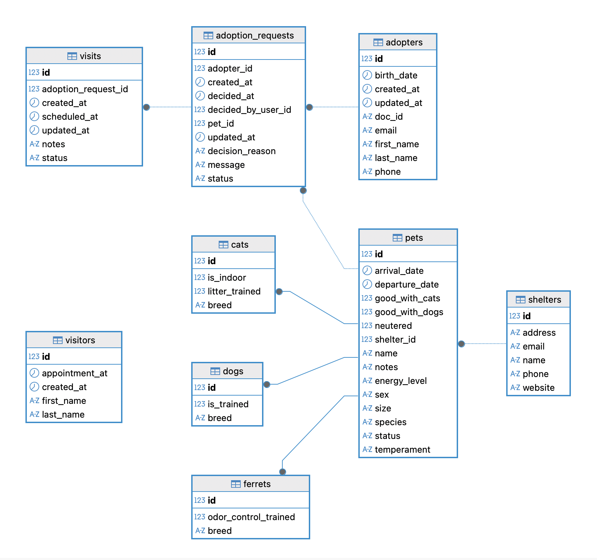

# 🐾 PetRescue 
## 🌟 Introducción
PetRescue es una API REST que gestiona un refugio animal: mascotas (perros, gatos y hurones), refugios, visitantes, adoptantes, solicitudes de adopción y visitas.
Construida con Java 17, Spring Boot 3, JPA/Hibernate y MySQL, con validación y tests de controller, repository y service.

## 🧠 Concepto Central
Conectar refugios con familias adoptantes de forma responsable, mostrando temperamento, energía y compatibilidades de cada animal.

## 🎯 Objetivos Principales
**Objetivo General:**

Desarrollar una API robusta y escalable que gestione el ciclo de adopción: registro de mascotas, solicitudes, visitas y decisión final.

**Objetivos Específicos:**

📚 Gestión Operativa: CRUD de shelter, pet, adopter y visitor; flujo de adoption request y visitas.

👨‍👩‍👧‍👦 Experiencia: visibilidad de temperamento, energía y compatibilidades.

🧱 Calidad Técnica: herencia JPA, validación, manejo de errores y tests.

## 📊 Alcance del Proyecto

Incluye:

✅ CRUD de Shelter, Pet, Adopter, Visitor

✅ AdoptionRequest (Pending/Approved/Rejected/Canceled)

✅ Visit (Scheduled/Completed/Canceled/NoShow)

✅ Herencia JPA (JOINED) para Pet → Dog/Cat/Ferret

Excluye (versión actual):

❌ Frontend

❌ Autenticación JWT/roles (bonus)

❌ Subida de imágenes

❌ Notificaciones

## ⚙️ Funcionalidades Principales

🐶 Mascotas: fechas de llegada/salida, estado, temperamento, energía y compatibilidades.

🏠 Refugios: ShelterData embebido, relación 1–N con Pet.

🧑 Personas: Visitor (cita) y Adopter con PersonalData embebido.

📝 AdoptionRequest: evita duplicados activos; aprobar → Pet.Adopted y auto-rechazo del resto.

📅 Visits: programar, reprogramar, cancelar y completar con validación de fechas futuras.

## Diagrama UML



## 🏗️ Arquitectura Técnica
```
┌─────────────────────────────┐
│        Controllers          │  ← REST API
├─────────────────────────────┤
│            DTOs             │  ← Validación + transporte
├─────────────────────────────┤
│          Services           │  ← Lógica de negocio
├─────────────────────────────┤
│         Repositories        │  ← Acceso a datos (JPA)
├─────────────────────────────┤
│       Models/Entities       │  ← Dominio (Herencia JPA)
├─────────────────────────────┤
│          Database           │  ← MySQL (H2 en tests)
└─────────────────────────────┘
```
Manejo de errores: @RestControllerAdvice global devuelve JSON consistente para 400/404/409/422/500.

## 🛠️ Stack Tecnológico

Java 17, Spring Boot 3.x (Web, Data JPA, Validation)

Hibernate/JPA (Herencia JOINED)

MySQL (runtime) + H2 (tests)

Lombok

JUnit 5, Mockito, Spring Test

DBeaver (SQL), Postman (pruebas)

## 🌐 API y Endpoints

Todos los endpoints usan/retornan JSON. Cuando hay body, usa Content-Type: application/json.

🏠 Shelters (/api/shelters)
```
GET    /api/shelters
GET    /api/shelters/{id}
POST   /api/shelters
PUT    /api/shelters/{id}
DELETE /api/shelters/{id}
```

POST
```
{ "name":"Refugio Central","email":"info@refugio.com","phone":"600000000","website":"https://refugio.com","address":"Calle 123" }
```

🐾 Pets (/api/pets)
```
GET    /api/pets
GET    /api/pets/{id}
POST   /api/pets
PATCH  /api/pets/{id}
DELETE /api/pets/{id}
```

Dog – POST
```
{
  "species":"Dog","name":"Luna","sex":"Female","size":"Medium",
  "arrivalDate":"2025-09-01","temperament":"Sociable","energyLevel":"Active",
  "goodWithDogs":true,"goodWithCats":false,"neutered":true,
  "shelterId":1,"breed":"Mestizo","isTrained":true
}
```

Cat – POST
```
{
  "species":"Cat","name":"Mishi","sex":"Female","size":"Small",
  "arrivalDate":"2025-09-01","temperament":"Sociable","energyLevel":"Neutral",
  "goodWithDogs":false,"goodWithCats":true,"neutered":true,
  "shelterId":1,"breed":"Europeo Común","litterTrained":true
}
```

Ferret – POST
```
{
  "species":"Ferret","name":"Noodle","sex":"Male","size":"Small",
  "arrivalDate":"2025-08-20","temperament":"Sociable","energyLevel":"Active",
  "goodWithDogs":true,"goodWithCats":true,"neutered":false,
  "shelterId":1,"breed":"Standard","odorControlTrained":true
}
```

👤 Adopters (/api/adopters)
```
GET    /api/adopters
GET    /api/adopters/{id}
POST   /api/adopters
PUT    /api/adopters/{id}
DELETE /api/adopters/{id}
```

POST
```
{
  "firstName":"Ana","lastName":"García","docId":"DNI-12345678Z",
  "email":"ana.garcia@example.com","phone":"600123123","birthDate":"1994-05-12"
}
```

👥 Visitors (/api/visitors)
```
GET    /api/visitors
GET    /api/visitors/{id}
POST   /api/visitors
PUT    /api/visitors/{id}
DELETE /api/visitors/{id}
POST   /api/visitors/{id}/convert-to-adopter
```

POST
```
{ "firstName":"María","lastName":"Pérez","appointmentAt":"2025-09-22T17:30:00" }
```

📝 Adoption Requests (/api/adoption-requests)
```
GET    /api/adoption-requests?petId=&adopterId=
POST   /api/adoption-requests
POST   /api/adoption-requests/{id}/approve
POST   /api/adoption-requests/{id}/reject
POST   /api/adoption-requests/{id}/cancel
```

Crear
```
{ "adopterId":1, "petId":5, "message":"Nos encanta y vivimos cerca del refugio." }
```

Decisión
```
{ "reason":"ok" }
```

📅 Visits (/api/visits)
```
GET    /api/visits?requestId=
POST   /api/visits/{requestId}
PATCH  /api/visits/{visitId}/reschedule
POST   /api/visits/{visitId}/cancel
POST   /api/visits/{visitId}/complete
```

Programar
```
{ "scheduledAt":"2025-09-20T12:30:00", "notes":"Primera visita con la familia" }
```

## 🎬 Casos de Uso

Crear solicitud: POST /adoption-requests → queda Pending.

Aprobar: POST /adoption-requests/{id}/approve → Pet.Adopted + auto-rechazo de otras Pending.

Agenda de visitas: POST /visits/{requestId} (fecha futura), reprogramar/cancelar/complete según evolución.

## 🧩 Instalación y Setup

Requisitos

Java 17, Maven 3.9+, MySQL 8+

Configuración

src/main/resources/application.properties
```
spring.datasource.url=jdbc:mysql://localhost:3306/paw_match?createDatabaseIfNotExist=true
spring.datasource.username=root
spring.datasource.password=ironhack
spring.jpa.hibernate.ddl-auto=update
spring.jpa.show-sql=true

spring.mvc.throw-exception-if-no-handler-found=true
spring.mvc.dispatch-options-request=true
```

Ejecutar
```
mvn clean package
mvn spring-boot:run
# o
java -jar target/petlove-0.0.1-SNAPSHOT.jar
```

Postman: importa una colección con los ejemplos de body incluidos arriba.

## 🧪 Testing
Perfil de test (H2)

src/test/resources/application-test.properties
```
spring.jpa.hibernate.ddl-auto=create-drop
spring.datasource.url=jdbc:h2:mem:petrescue;MODE=MySQL;DB_CLOSE_DELAY=-1;DATABASE_TO_UPPER=false
spring.datasource.driver-class-name=org.h2.Driver
spring.datasource.username=sa
spring.datasource.password=
spring.jpa.show-sql=false
```
Ejecutar tests
```
mvn -Dspring.profiles.active=test test
```
**Cobertura actual**

Controller (Web slice): AdopterControllerTest

Verifica POST /api/adopters → 201 Created, header Location, JSON esperado.

Repository (Data JPA): ShelterRepositoryTest

Persiste y lee @Embeddable ShelterData.

Service (unitario con Mockito): VisitServiceImplTest

Programa visita sólo si la AdoptionRequest está Pending y la fecha es futura; reprograma/cancela.


## 🚀 Futuras Mejoras

🔐 JWT + roles (admin/voluntario/adoptante)

🔎 Búsquedas avanzadas (Specifications) y “match” sugerido

🖼️ Fotos de mascotas

📨 Emails (confirmación de visitas)

📈 Actuator/Métricas, logs

🗂️ Migraciones (Flyway/Liquibase)

## 🔗 Enlaces y Créditos

📂 Repositorio: [GitHub](https://github.com/PPM-C/PetRescue.git)

🧪 Colección Postman: [Pamela Workspace](https://pamelapalacios-892168.postman.co/workspace/641a9255-7576-4b1f-8a20-b75f954aed01/collection/46790740-841cc4c8-6360-4131-895c-3346a089d522?action=share&source=copy-link&creator=46790740)

🖥️ Slides: [Ver presentación](https://gamma.app/docs/PetRescue-Project-1jg2aprtolv1le1)

👤 Autor/a: Pamela Palacios
